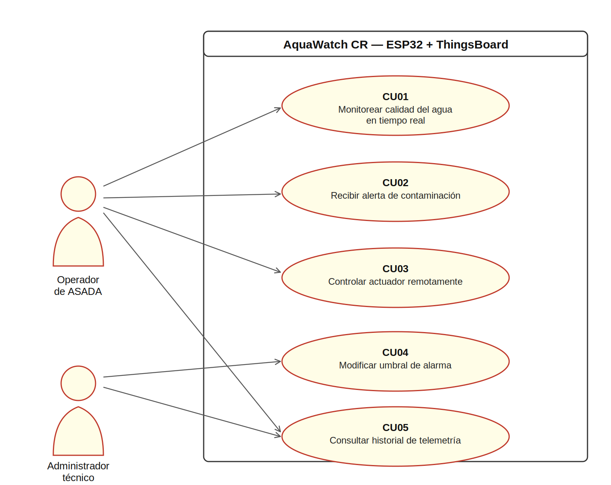
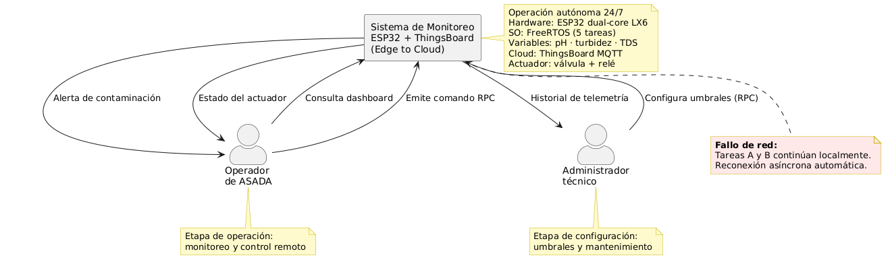
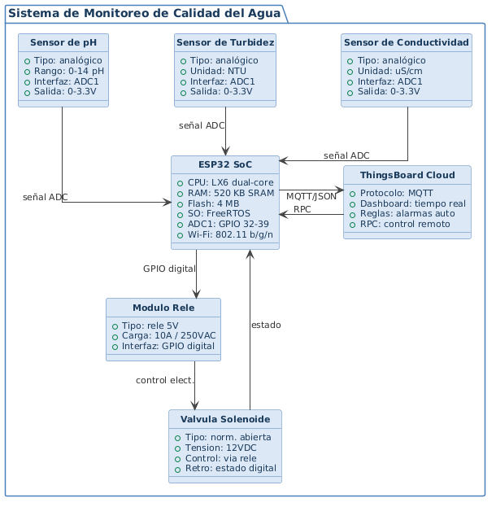
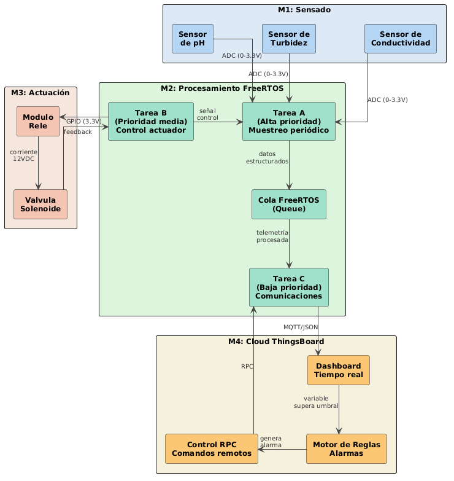

# Proyecto3_Embebidos
Sistema embebido Edge-to-Cloud para monitoreo de calidad del agua en tiempo real, desarrollado con ESP32 + FreeRTOS y ThingsBoard. Proyecto del curso Taller de Sistemas Embebidos, Escuela de Ingeniería Electrónica, Instituto Tecnológico de Costa Rica. Alineado al ODS 6 — Agua Limpia y Saneamiento. | Grupo Bit Bakers

## Justificación del Problema

### Contexto Nacional

Costa Rica enfrenta una crisis creciente en la calidad del agua para consumo humano a pesar de su abundancia hídrica. Análisis realizados durante los últimos 15 años identificaron cambios en la calidad del agua sujetos a variables climáticas y errores en los sistemas de distribución, donde una fuente apta en época seca puede presentar un aumento significativo de turbidez durante la temporada lluviosa [1].

### Problemática en Cartago

La provincia de Cartago concentra algunos de los casos más críticos del país:

- Desde **2022**, Cipreses de Oreamuno enfrenta distribución de agua contaminada con clorotalonil y otros plaguicidas [2].
- En **marzo de 2024**, la ARESEP solicitó declarar estado de emergencia en la zona norte de Cartago por contaminación con agroquímicos en fuentes de once ASADAS, afectando directamente a **33.000 habitantes**. El 80% del área de protección de 35 nacientes estudiadas estaba invadido por cultivos e infraestructura agrícola [3].
- En **febrero de 2024**, Turrialba entró en crisis por contaminación con hidrocarburos, requiriendo análisis rigurosos antes de reautorizar el consumo [4].
- El Ministerio de Salud, AyA, MINAE, MAG y universidades debieron emprender acciones conjuntas de vigilancia y contención en 2024 ante la magnitud del problema [5].

### Causa Raíz

El problema estructural no es únicamente la presencia de contaminantes, sino la **ausencia de vigilancia continua y automatizada** en los puntos de captación. El monitoreo actual es reactivo, manual y periódico, con tiempos de respuesta lentos que dependen de laboratorios institucionales.

### Limitación del Sistema

Este prototipo opera como capa de alerta temprana de bajo costo. No sustituye análisis de laboratorio certificados para bacterias, metales pesados o agroquímicos específicos.

---

## Requisitos del Sistema

---

### FR — Requisitos Funcionales

#### Módulo de Sensado

**[FR-01] Muestreo periódico de variables físico-químicas**
El sistema deberá leer de forma periódica y determinista los valores de pH, turbidez y
conductividad del agua mediante los sensores conectados a los pines ADC del ESP32.
*Justificación: El monitoreo continuo es la base del sistema de alerta temprana. Sin
muestreo periódico no es posible detectar cambios bruscos en la calidad del agua.*

**[FR-02] Procesamiento local de señal**
El sistema deberá convertir las lecturas analógicas crudas del ADC a unidades físicas
calibradas (pH en escala 0-14, turbidez en NTU, conductividad en µS/cm) antes de
enviarlas a la cola de comunicaciones.
*Justificación: Los valores crudos del ADC no tienen significado físico directo. La
conversión local en el Edge evita enviar datos sin interpretar a la nube.*

---

#### Módulo de Procesamiento Local (FreeRTOS)

**[FR-03] Arquitectura multitarea estricta**
El sistema deberá implementar un mínimo de 5 tareas de usuario en FreeRTOS con
prioridades diferenciadas, incluyendo obligatoriamente:
- **Tarea A (Alta prioridad):** Muestreo periódico de sensores y procesamiento local. Su periodo de ejecución debe cumplirse de manera determinista.
- **Tarea B (Prioridad media):** Ejecución de algoritmos de control local y control de actuadores por comandos directos o remotos (RPC).
- **Tarea C (Baja prioridad):** Gestión de la pila TCP/IP, reconexión de Wi-Fi y publicación de datos por MQTT hacia ThingsBoard. Esta tarea no debe bloquear el procesador ni degradar el determinismo de la Tarea A.

*Justificación: La asignación de prioridades diferenciadas garantiza que las operaciones
de red de baja criticidad no interrumpan el sensado, que es la función crítica del sistema.*

**[FR-04] Comunicación entre tareas mediante colas**
El sistema deberá transferir los datos de telemetría procesados desde la Tarea A hacia
la Tarea C exclusivamente mediante colas (Queues) de FreeRTOS.
*Justificación: Las colas garantizan transferencia de datos segura y sin condiciones
de carrera entre tareas de diferente prioridad.*

**[FR-05] Protección de recursos compartidos**
El sistema deberá proteger el acceso al bus de sensores y a otros periféricos
compartidos mediante semáforos o mutexes de FreeRTOS, evitando condiciones de
carrera e inversión de prioridades.
*Justificación: Sin protección de recursos compartidos el sistema puede producir
lecturas corruptas o comportamiento no determinista.*

---

#### Módulo de Comunicaciones

**[FR-06] Publicación de telemetría por MQTT**
El sistema deberá publicar periódicamente un payload JSON estructurado con los
valores de pH, turbidez y conductividad hacia el broker MQTT de ThingsBoard.
*Justificación: MQTT es el protocolo estándar de IoT industrial de baja latencia y
bajo consumo energético, requerido explícitamente por el instructivo del proyecto.*

**[FR-07] Reconexión automática ante caída de red**
El sistema deberá detectar la pérdida de conectividad Wi-Fi o MQTT y reconectarse
de forma asíncrona sin bloquear las tareas de sensado y control. No se permite el
uso de bucles de espera indefinidos (`while(!connected)`) dentro de las tareas principales.
*Justificación: La disponibilidad del monitoreo local no puede depender de la
estabilidad de la red. Las tareas críticas deben continuar operando durante
desconexiones.*

---

#### Módulo de Nube (ThingsBoard)

**[FR-08] Visualización de telemetría en tiempo real**
La plataforma ThingsBoard deberá mostrar en un dashboard los valores actuales e
históricos de pH, turbidez y conductividad mediante widgets gráficos actualizados
en tiempo real.
*Justificación: La visualización continua permite al operador de la ASADA identificar
tendencias y anomalías sin necesidad de desplazarse al punto de captación.*

**[FR-09] Generación de alarmas automáticas**
El motor de reglas de ThingsBoard deberá generar una alerta visual cuando cualquier
variable supere los umbrales críticos definidos (pH < 6.5 o pH > 8.5, turbidez > 4
NTU según normativa AyA).
*Justificación: La alerta automática elimina la dependencia de monitoreo humano
continuo, que es precisamente la debilidad del sistema actual en Cartago.*

**[FR-10] Control remoto mediante RPC**
El dashboard de ThingsBoard deberá permitir al operador enviar comandos RPC hacia
la ESP32 para: (a) activar o desactivar el actuador físico, y (b) modificar en tiempo
real las constantes de umbral de alarma, con respuesta confirmada en menos de
1 segundo.
*Justificación: La modificación remota de umbrales permite adaptar el sistema a
condiciones estacionales sin reprogramar el firmware. El control del actuador permite
aislar una fuente contaminada sin desplazamiento físico al sitio.*

---

#### Módulo de Actuación

**[FR-11] Control de actuador con retroalimentación de estado**
El sistema deberá controlar un actuador físico (válvula o bomba) y reportar su estado
actual (activo/inactivo) de vuelta a ThingsBoard como atributo del dispositivo.
*Justificación: La retroalimentación de estado confirma al operador que el comando
RPC fue ejecutado correctamente en el hardware.*

---

### NFR — Requisitos No Funcionales

#### Módulo de Procesamiento Local (FreeRTOS)

**[NFR-01] Determinismo temporal de la tarea de sensado**
El periodo de ejecución de la Tarea A no deberá desviarse más de ±5 ms de su
periodo nominal, incluso bajo carga máxima de la pila TCP/IP.
*Justificación: El determinismo es la propiedad fundamental de un RTOS. Sin él el
sistema no puede garantizar que detectará un evento de contaminación dentro de una
ventana de tiempo predecible.*

**[NFR-02] Operación autónoma ante desconexión de red**
El sistema deberá continuar ejecutando las tareas de sensado y control de forma
ininterrumpida durante al menos 30 segundos de desconexión total de red, sin
requerir intervención manual ni reset físico del microcontrolador.
*Justificación: El instructivo exige explícitamente esta prueba de resiliencia durante
la demostración E2, donde el profesor desconectará el enrutador durante 30 segundos.*

---

#### Módulo de Comunicaciones

**[NFR-03] Latencia de publicación MQTT**
El tiempo entre la adquisición de una muestra y su disponibilidad en el dashboard de
ThingsBoard no deberá superar los 2 segundos bajo condiciones normales de red.
*Justificación: Una latencia mayor reduciría la utilidad del sistema como herramienta
de alerta temprana ante eventos de contaminación aguda.*

---

#### Módulo de Nube (ThingsBoard)

**[NFR-04] Tiempo de respuesta RPC**
El actuador físico deberá responder a un comando RPC emitido desde ThingsBoard
en menos de 1 segundo desde que el operador ejecuta la acción en el dashboard.
*Justificación: Una respuesta lenta en una situación de emergencia hídrica puede
significar que agua contaminada continúe distribuyéndose durante el tiempo de
latencia.*

---

### CON — Restricciones

#### Módulo de Procesamiento Local (FreeRTOS)

**[CON-01] Plataforma de hardware**
El sistema deberá ejecutarse exclusivamente sobre el SoC ESP32 con procesador de
doble núcleo Tensilica Xtensa LX6, sin posibilidad de migrar a otra plataforma
durante el desarrollo del proyecto.

**[CON-02] Sistema operativo**
El firmware deberá desarrollarse obligatoriamente sobre FreeRTOS. No se permite
el uso de un bucle secuencial clásico `void loop()` con `delay()` bloqueantes como
arquitectura principal.

---

#### Módulo de Sensado

**[CON-03] Pines ADC permitidos**
Los sensores analógicos deberán conectarse exclusivamente a pines del ADC1 del
ESP32 (GPIO 32–39). El ADC2 queda prohibido debido a su incompatibilidad con el
módulo Wi-Fi activo.

**[CON-04] Emulación analógica de sensores**
En caso de que algún sensor físico sea de difícil acceso, se permite su emulación
mediante generadores de señal analógica por hardware (potenciómetro o DAC).
No se acepta la emulación por software puro como sustituto de una señal física
en el pin ADC.
*Justificación: El instructivo permite expresamente esta modalidad condicionada a
justificación por dificultad de acceso al sensor.*

---

#### Módulo de Comunicaciones

**[CON-05] Protocolo de comunicación**
El protocolo de enlace entre el ESP32 y ThingsBoard deberá ser MQTT con payload
en formato JSON. El uso de HTTP solo es admisible con justificación energética
documentada.

---

#### Módulo de Nube (ThingsBoard)

**[CON-06] Plataforma de nube**
La visualización, gestión de alarmas y control remoto deberán implementarse
exclusivamente sobre ThingsBoard. No se permite el uso de plataformas alternativas
como AWS IoT, Azure IoT Hub o Node-RED como sustitutos.

## Casos de Uso

### CU01 — Monitorear calidad del agua en tiempo real
**Identificador:** CU01 - Monitorear calidad del agua en tiempo real  
**Actores:** Operador de ASADA  
**Propósito:** Permitir al operador visualizar en tiempo real los valores de pH, turbidez y
conductividad del agua captada, para detectar anomalías en la calidad del agua sin
necesidad de desplazarse al punto de captación.  
**Precondiciones:** El nodo ESP32 está encendido y conectado a la red Wi-Fi, el broker
MQTT está activo, el dashboard de ThingsBoard está configurado y el operador tiene
acceso a la plataforma.  
**Postcondiciones:** El operador visualiza los valores actuales e históricos de las variables
monitoreadas en el dashboard de ThingsBoard.  
**Flujo principal:** El operador accede al dashboard de ThingsBoard desde un navegador
web. El sistema muestra los valores más recientes de pH, turbidez y conductividad
publicados por el ESP32 vía MQTT. El operador analiza las gráficas históricas para
identificar tendencias o cambios bruscos en la calidad del agua.

---

### CU02 — Recibir alerta de contaminación
**Identificador:** CU02 - Recibir alerta de contaminación  
**Actores:** Operador de ASADA  
**Propósito:** Notificar al operador cuando alguna variable físico-química supera los
umbrales críticos definidos, para que pueda tomar acciones correctivas de forma
inmediata.  
**Precondiciones:** CU01 está activo, el motor de reglas de ThingsBoard tiene configurada
al menos una regla de negocio con umbrales críticos definidos.  
**Postcondiciones:** El operador recibe una alerta visual en el dashboard de ThingsBoard
indicando la variable que superó el umbral y su valor actual.  
**Flujo principal:** El ESP32 publica un valor que supera el umbral crítico configurado. El
motor de reglas de ThingsBoard detecta la condición y genera un estado de alerta. El
dashboard despliega una notificación visual al operador indicando la variable afectada,
su valor actual y el umbral superado.

---

### CU03 — Controlar actuador remotamente
**Identificador:** CU03 - Controlar actuador remotamente  
**Actores:** Operador de ASADA  
**Propósito:** Permitir al operador activar o desactivar el actuador físico (válvula o bomba)
desde ThingsBoard mediante un comando RPC, para aislar una fuente contaminada sin
necesidad de desplazarse al sitio.  
**Precondiciones:** CU01 está activo, el ESP32 está conectado al broker MQTT y el
widget de control RPC está configurado en el dashboard.  
**Postcondiciones:** El actuador cambia su estado físico (activo/inactivo) y ThingsBoard
refleja el nuevo estado como atributo del dispositivo en menos de 1 segundo.  
**Flujo principal:** El operador identifica una anomalía en la calidad del agua. El operador
accede al widget de control en el dashboard de ThingsBoard y emite un comando RPC.
ThingsBoard transmite el comando al ESP32 vía MQTT. La Tarea B del firmware ejecuta
el comando y cambia el estado del actuador. El ESP32 reporta el nuevo estado de vuelta
a ThingsBoard como confirmación.

---

### CU04 — Modificar umbral de alarma
**Identificador:** CU04 - Modificar umbral de alarma  
**Actores:** Administrador técnico  
**Propósito:** Permitir al administrador técnico modificar remotamente las constantes de
umbral crítico de cada variable físico-química, para adaptar el sistema a condiciones
estacionales sin necesidad de reprogramar el firmware.  
**Precondiciones:** El administrador técnico tiene acceso al dashboard de ThingsBoard
con permisos de configuración, el ESP32 está conectado al broker MQTT.  
**Postcondiciones:** El nuevo valor de umbral queda almacenado en el ESP32 y el motor
de reglas de ThingsBoard utiliza el valor actualizado para las alertas subsiguientes.  
**Flujo principal:** El administrador técnico accede al widget de configuración en el
dashboard de ThingsBoard. Ingresa el nuevo valor de umbral para la variable deseada y
emite el comando RPC correspondiente. El ESP32 recibe el comando, actualiza la
constante de umbral en memoria y confirma el cambio a ThingsBoard.

---

### CU05 — Consultar historial de telemetría
**Identificador:** CU05 - Consultar historial de telemetría  
**Actores:** Operador de ASADA, Administrador técnico  
**Propósito:** Permitir consultar el registro histórico de las variables monitoreadas para
identificar patrones de contaminación, correlacionar eventos con actividad agrícola o
climática y generar evidencia técnica ante autoridades como el AyA o el MINAE.  
**Precondiciones:** El sistema ha estado operando y ThingsBoard ha almacenado datos
históricos de telemetría.  
**Postcondiciones:** El usuario visualiza las series temporales de las variables
seleccionadas en el rango de fechas consultado.  
**Flujo principal:** El usuario accede al dashboard de ThingsBoard y selecciona el rango
de fechas a consultar. El sistema despliega las series temporales de pH, turbidez y
conductividad para el periodo seleccionado. El usuario analiza los datos para identificar
patrones o generar reportes.

## Concepto de Operaciones (ConOps)

El sistema opera de forma autónoma las 24 horas con intervención humana únicamente cuando se detecta una anomalía o se requiere una acción de control remoto. Se definen tres escenarios de operación:

**Flujo normal:** La Tarea A muestrea periódicamente pH, turbidez y conductividad. Los datos pasan por una cola FreeRTOS a la Tarea C, que los publica por MQTT hacia ThingsBoard. El operador de ASADA visualiza la telemetría en tiempo real desde el dashboard sin desplazarse al punto de captación.

**Fallo de red:** Ante una desconexión, las Tareas A y B continúan operando de forma ininterrumpida. La Tarea C ejecuta reconexión asíncrona automática sin intervención manual ni reset físico del microcontrolador.

**Flujo de alarma:** Cuando una variable supera el umbral crítico, el motor de reglas de ThingsBoard genera una alerta visual. El operador emite un comando RPC para activar el actuador físico (válvula o bomba), que responde en menos de 1 segundo y confirma su nuevo estado al dashboard.

## Diagrama de Definición de Bloques (BDD)

El BDD describe la descomposición física del sistema en sus bloques constitutivos y las
relaciones entre ellos. El bloque raíz es el **Sistema de Monitoreo de Calidad del Agua**,
que contiene los siguientes sub-bloques:

- **ESP32 SoC:** Núcleo del sistema Edge. Ejecuta FreeRTOS con cinco tareas concurrentes,
gestiona la adquisición de datos mediante el ADC1, controla el actuador por GPIO y mantiene
la conectividad Wi-Fi con ThingsBoard.

- **Sensor de pH, Sensor de Turbidez y Sensor de Conductividad:** Tres sensores analógicos
conectados al ADC1 del ESP32 (GPIO 32–39). Entregan señales de 0 a 3.3V proporcionales a
las variables físico-químicas del agua. Quedan excluidos del ADC2 por incompatibilidad con
el módulo Wi-Fi activo.

- **Módulo Relé:** Interfaz de potencia entre el ESP32 y la válvula solenoide. Recibe una
señal digital desde un GPIO del ESP32 y conmuta la carga eléctrica de la válvula.

- **Válvula Solenoide:** Actuador físico del sistema. Controlada por el relé, permite aislar
la fuente de agua ante una detección de contaminación. Reporta su estado de vuelta al ESP32
como retroalimentación.

- **ThingsBoard Cloud:** Capa de nube del sistema. Recibe telemetría por MQTT, la visualiza
en un dashboard en tiempo real, ejecuta reglas de negocio para generar alarmas automáticas
y envía comandos RPC de vuelta al ESP32 para control remoto del actuador.

## Diagrama de Bloques Internos (IBD)

El IBD describe los flujos de información y energía entre los bloques internos del sistema,
organizados en cuatro módulos funcionales:

**M1 — Sensado:** Tres sensores analógicos (pH, turbidez y conductividad) entregan señales
de voltaje entre 0 y 3.3V hacia la Tarea A del ESP32 a través del ADC1.

**M2 — Procesamiento FreeRTOS:** La Tarea A realiza el muestreo periódico y deposita los
datos estructurados en la Cola FreeRTOS. La Cola transfiere la telemetría procesada hacia
la Tarea C de comunicaciones. La Tarea B recibe señales de control de la Tarea A y gobierna
el actuador físico.

**M3 — Actuación:** El Módulo Relé recibe una señal digital GPIO de 3.3V desde la Tarea B
y conmuta la corriente de 12VDC hacia la Válvula Solenoide. La válvula reporta su estado
de vuelta a la Tarea B como señal de feedback.

**M4 — Cloud ThingsBoard:** La Tarea C publica la telemetría por MQTT/JSON hacia el
Dashboard. Cuando una variable supera el umbral crítico, el Motor de Reglas genera una
alarma y activa el módulo de Control RPC, que envía el comando de vuelta al ESP32.

## Referencias

[1] B. Camarillo, "¿Cómo está la calidad del agua en Costa Rica? Bacterias y contaminantes se encontraron en estas zonas," *La República*, 31 oct. 2024. [En línea]. Disponible en: https://www.larepublica.net/noticia/como-esta-la-calidad-del-agua-en-costa-rica-bacterias-y-contaminantes-se-encontraron-en-estas-zonas

[2] Delfino.cr, "Agua tóxica," 9 jul. 2025. [En línea]. Disponible en: https://delfino.cr/2025/07/agua-toxica

[3] Semanario Universidad, "Emergencia ambiental: más de 69 fuentes de agua en Cartago estarían contaminadas," 15 oct. 2024. [En línea]. Disponible en: https://semanariouniversidad.com/opinion/emergencia-ambiental-mas-de-69-fuentes-de-agua-en-cartago-estarian-contaminadas/

[4] Prensa Latina, "Autorizan en Costa Rica consumo de agua tras contaminación," 13 feb. 2024. [En línea]. Disponible en: https://www.prensa-latina.cu/2024/02/13/autorizan-en-costa-rica-consumo-de-agua-tras-contaminacion/

[5] Ministerio de Salud de Costa Rica, "Autoridades comparten resultados del análisis en fuentes de agua en Zona de Cartago," 28 oct. 2024. [En línea]. Disponible en: https://www.ministeriodesalud.go.cr/index.php/prensa/61-noticias-2024/1980-autoridades-comparten-resultados-del-analisis-en-fuentes-de-agua-en-zona-de-cartago
